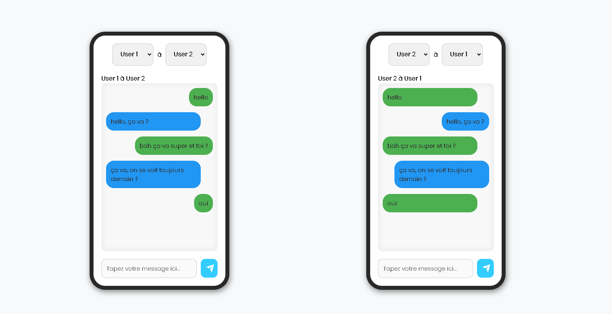

# React Chat Application



## Overview

A modern, real-time chat application built with React and Vite that simulates conversations between multiple users. The application features a unique dual-phone interface allowing users to test and visualize conversations between different participants simultaneously.

## 🚀 Technical Stack

- **Frontend Framework:** React 18.3.1
- **Build Tool:** Vite 6.0.5
- **Styling:** CSS3 with custom animations
- **Development Environment:** Node.js
- **Code Quality:** ESLint 9.17.0

## ✨ Features

- **Multi-User Support:** Supports up to 5 different users with unique color identifiers
- **Dual Interface:** Two phone simulators running simultaneously
- **Real-Time Message Updates:** Instant message delivery simulation
- **Responsive Design:** Mobile-first approach with elegant phone-like UI
- **User Selection:** Dynamic user switching for both sender and recipient
- **Custom Styling:** Unique message bubbles with user-specific colors
- **Animated Components:** Smooth transitions and hover effects
- **Cross-Browser Compatible:** Works across modern browsers

## 🛠 Installation

1. Clone the repository:

```bash
git clone https://github.com/michel-dc/chat-app-main-v2.git
```

2. Install dependencies:

```bash
cd chat-app-main-v2
npm install
```

3. Start the development server:

```bash
npm run dev
```

## 🎨 Styling

The application uses a combination of modern CSS features:

- CSS Custom Properties for theme colors
- Flexbox for layout management
- CSS Animations for interactive elements
- Mobile-first responsive design
- Custom scrollbar styling
- Shadow effects for depth

## 🔍 Development

### Scripts

- `npm run dev` - Start development server
- `npm run build` - Build for production
- `npm run lint` - Run ESLint
- `npm run preview` - Preview production build

### ESLint Configuration

The project uses a custom ESLint configuration with:

- React-specific rules
- React Hooks rules
- Modern JavaScript features support

## 🤝 Contributing

1. Fork the repository
2. Create your feature branch (`git checkout -b feature/AmazingFeature`)
3. Commit your changes (`git commit -m 'Add some AmazingFeature'`)
4. Push to the branch (`git push origin feature/AmazingFeature`)
5. Open a Pull Request

## 📝 License

This project is licensed under the MIT License - see the [LICENSE](LICENSE) file for details.

## 🙏 Acknowledgments

- React team for the amazing framework
- Vite team for the build tool
- The open-source community for inspiration
